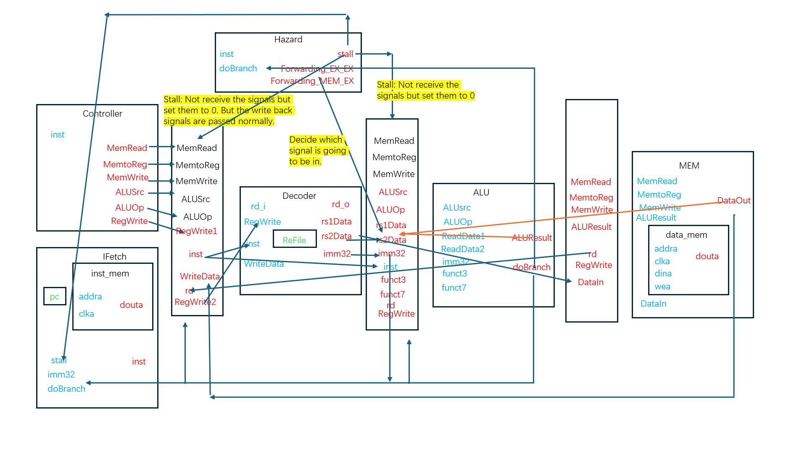

# cs202_MiniRiscVCPU

## The Structure Diagram

## Settings of IPcore

### Instruction Memory
Component Name: prgrom
#### **Basic**
* Memory type: Single Port ROM

#### **Port A Options**

* Port A Width: 32
* Port A Depth: 16384
* Enable Port Type: Always Enabled
* Primitives Output Register: No
#### **Other Options**
* Load Init File: Load your instruction coe file.

### Data Memory
Component Name: data_mem
#### **Basic**
* Memory type: Single Port RAM
#### **Port A Options**
* Write Width: 32
* Read Width: 32
* Write Depth: 16384
* Read Depth: 16384
* Enable Port Type: Always Enabled
* Primitives Output Register: No
#### **Other Options**
* Load Init File: No

## Signals

### ALUSrc

ALUSrc[0]: Controls input data 1 of ALU, 0 reg, 1 pc
ALUSrc[1]: Controls input data 2 of ALU, 0 reg, 1 imm32

### ALUOp

0: Register and register
1: Register and immediate
2: Load and store
3: Branch
4: Jump (rd = PC + 4)
5: Load immediate (rd = imm)