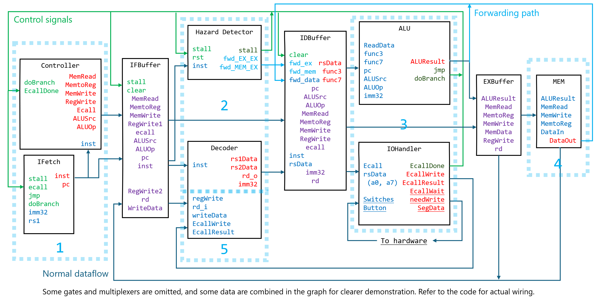

# CS202_Mini RiscV CPU

A 5-cycle pipelined CPU designed for EGO1 board `xc7a35tcsg324-1`, as a course project for CS202 Computer Organizations in SUSTech. Refer to the `doc.md` file for detailed documentation.

## The Structure Diagram

## Setting up project

The project is managed using Vivado 2017.4. To set up, clone the repo, create a new project in vivado, and add design sources, simulation sources, constraints, and optionally coefficient file for the instruction memory. Configure the ipcores as the follows.

## Usage

Init the instruction memory with your program coe file, generate bitstream and write to the EGO1 FPGA board. Details are in the `doc.md` file.

## Settings of IPCores

### Clocking

Name in IP Catalog: Clocking Wizard

Component Name: `clk_wiz_0`

#### Output Clocks

- clk_out1: 45.000 MHz
- Optional inputs/outputs: all disabled.

### Instruction Memory

Name in IP Catalog: Block Memory Generator

Component Name: `prgrom` 

#### **Basic**
* Memory type: Single Port ROM

#### **Port A Options**

* Port A Width: 32
* Port A Depth: 16384
* Enable Port Type: Always Enabled
* Primitives Output Register: No
#### **Other Options**
* Load Init File: Load your instruction coe file.

### Data Memory

Name in IP Catalog: Block Memory Generator

Component Name: `data_mem`
#### **Basic**
* Memory type: Single Port RAM
#### **Port A Options**
* Write Width: 32
* Read Width: 32
* Write Depth: 16384
* Read Depth: 16384
* Enable Port Type: Always Enabled
* Primitives Output Register: No
#### **Other Options**
* Load Init File: No

## Signals

### ALUSrc

ALUSrc[0]: Controls input data 1 of ALU, 0 reg, 1 pc
ALUSrc[1]: Controls input data 2 of ALU, 0 reg, 1 imm32

### ALUOp

0: Register and register
1: Register and immediate
2: Load and store
3: Branch
4: jal (rd = PC + 4, pc += imm)
5: jalr (rd = PC + 4, pc = rs1 + imm)
6: Load immediate (rd = imm)