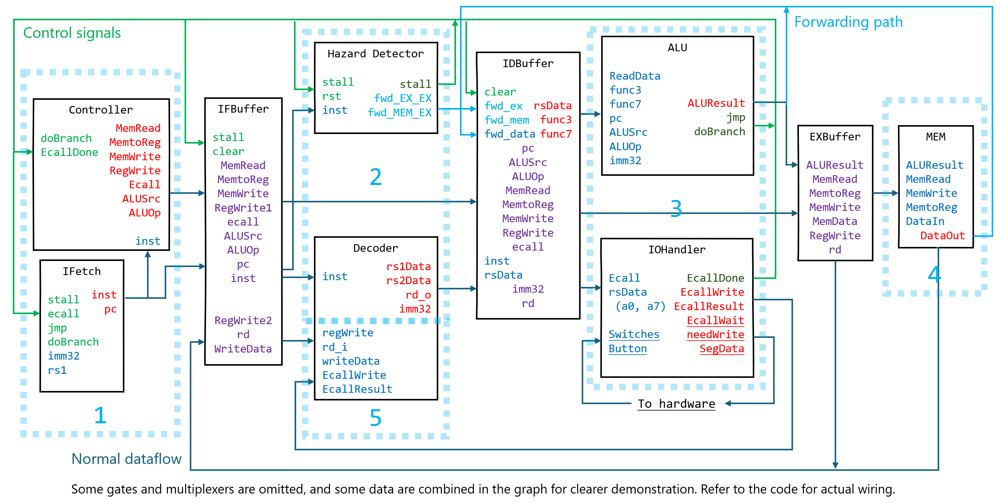

# CS202 Project Mini RV32 CPU
## 硬件及开发者

硬件：EGO1开发板 xc7a35tcsg324-1

| 成员 | 工作 | 贡献比 |
| --- | --- | --- |
| 12211429 何星熠 | CPU 各模块具体功能实现 | 35%|
| 12211426 简越 | CPU 设计图绘制，测试用例汇编文件编写 | 35%|
| 12211120 迟湛铧 | 代码整理，电子管模块，硬件绑定 | 30%|

## 开发计划

### 日程安排

| 周   | 计划        | 完成情况                                                     |
| ---- | ----------- | ------------------------------------------------------------ |
| 9    | 小组见面    | 建好了群                                                     |
| 10   | 设计CPU模块 | 计划参考课本上的设计图，最终决定使用PPT绘制设计图，完成初稿以及任务分配 |
| 11   | 写代码      |                                                              |
| 12   | 写代码      |                                                              |
| 13   | 写代码      | 基本模块全部完成，还剩IO和外设，asm文件需要调整              |
| 14   | 测试        | 实现计划实现的所有功能                                       |
| 15   | 答辩        |                                                              |

### 版本修改记录

完整开发过程记录在GitHub上：

https://github.com/Prurite/cs202_MiniRiscVCPU

## CPU架构设计说明

### CPU特性

#### ISA

支持大部分标准 RV32I 指令

| Inst Name              | FMT           | Opcode  | funct3 | funct7 | Description                                  |
|------------------------|---------------|---------|--------|--------|----------------------------------------------|
| add                    | ADD           | R       | 0110011| 0x0    | 0x00    |
| sub                    | SUB           | R       | 0110011| 0x0    | 0x20    |
| xor                    | XOR           | R       | 0110011| 0x4    | 0x00    |
| or                     | OR            | R       | 0110011| 0x6    | 0x00    |
| and                    | AND           | R       | 0110011| 0x7    | 0x00    |
| sll                    | Shift Left Logical | R       | 0110011| 0x1    | 0x00    |
| srl                    | Shift Right Logical | R       | 0110011| 0x5    | 0x00    |
| sra                    | Shift Right Arith* | R       | 0110011| 0x5    | 0x20    |
| slt                    | Set Less Than | R       | 0110011| 0x2    | 0x00    |
| sltu                   | Set Less Than (U) | R       | 0110011| 0x3    | 0x00    |
| addi                   | ADD Immediate | I       | 0010011| 0x0    |         |
| xori                   | XOR Immediate | I       | 0010011| 0x4    |         |
| ori                    | OR Immediate  | I       | 0010011| 0x6    |         |
| andi                   | AND Immediate | I       | 0010011| 0x7    |         |
| slli                   | Shift Left Logical Imm | I  | 0010011| 0x1    | imm[11:5]=0x00 |
| srli                   | Shift Right Logical Imm | I  | 0010011| 0x5    | imm[11:5]=0x00 |
| srai                   | Shift Right Arith Imm | I  | 0010011| 0x5    | imm[11:5]=0x20 |
| slti                   | Set Less Than Imm | I    | 0010011| 0x2    |         |
| sltiu                  | Set Less Than Imm (U) | I  | 0010011| 0x3    |         |
| lw                     | Load Word     | I       | 0000011| 0x2    |         |
| sw                     | Store Word    | S       | 0100011| 0x2    |         |
| beq                    | Branch ==     | B       | 1100011| 0x0    |         |
| bne                    | Branch !=     | B       | 1100011| 0x1    |         |
| blt                    | Branch <      | B       | 1100011| 0x4    |         |
| bge                    | Branch ≥      | B       | 1100011| 0x5    |         |
| bltu                   | Branch < (U)  | B       | 1100011| 0x6    |         |
| bgeu                   | Branch ≥ (U)  | B       | 1100011| 0x7    |         |
| jal                    | Jump And Link | J       | 1101111|        |         |
| jalr                   | Jump And Link Reg | I   | 1100111| 0x0    |         |
| lui                    | Load Upper Imm | U      | 0110111|        |         |
| auipc                  | Add Upper Imm to PC | U | 0010111|        |         |
| ecall*                 | Environment Call | I   | 1110011| 0x0    | imm=0x0 |

*`ecall` 只支持部分 IO 调用，详见“对外设 IO 的支持”。

#### 寄存器

共 32 个，位宽 32bit ，编号为 x0 – x31，其中 x3(sp) 初始化为 65536 ， 其余初始化为 0 。

#### CPU时钟

多周期，支持 pipeline，五级流水。正常指令一条需 5 个周期，由于 5 级流水线，在不存在需 stall 的 hazard 时，CPI 为 1。采用转发（forwarding）、分支预测以及挂起（stall）方式解决流水线冲突。

#### 寻址空间设计

哈佛结构；最小寻址单位 1 word / 4 bytes ，指令空间 16384 words / 65536 bytes，数据空间 16384 words / 65536 bytes，栈空间基地址 65536 。

#### 对外设 IO 的支持

采用 `ecall` 指令，及 a0, a7 寄存器中的参数进行 IO ，IO 中断结束后返回值（如有）存于 a0 中。

a7 支持的参数：1，以 16 进制输出 a0 中的 32 位整数到数码管；5，从拨码开关读入 8 位二进制数至 a0 的低 8 位）。

### CPU接口

#### 时钟

```verilog
set_property PACKAGE_PIN P17 [get_ports clk_hw]  
```

#### 复位

```verilog
set_property PACKAGE_PIN P15 [get_ports rst] 
```

#### 其他常用IO接口

```
# IO proceed button

set_property PACKAGE_PIN R11 [get_ports Button]

# Switches are mapped to IO input 

set_property PACKAGE_PIN P5 [get_ports {Switches[7]}]
set_property PACKAGE_PIN P4 [get_ports {Switches[6]}]
set_property PACKAGE_PIN P3 [get_ports {Switches[5]}]
set_property PACKAGE_PIN P2 [get_ports {Switches[4]}]
set_property PACKAGE_PIN R2 [get_ports {Switches[3]}]
set_property PACKAGE_PIN M4 [get_ports {Switches[2]}]
set_property PACKAGE_PIN N4 [get_ports {Switches[1]}]
set_property PACKAGE_PIN R1 [get_ports {Switches[0]}]

# 7-segment displays (selection)

set_property PACKAGE_PIN G2 [get_ports {an[7]}]
set_property PACKAGE_PIN C2 [get_ports {an[6]}]
set_property PACKAGE_PIN C1 [get_ports {an[5]}]
set_property PACKAGE_PIN H1 [get_ports {an[4]}]
set_property PACKAGE_PIN G1 [get_ports {an[3]}]
set_property PACKAGE_PIN F1 [get_ports {an[2]}]
set_property PACKAGE_PIN E1 [get_ports {an[1]}]
set_property PACKAGE_PIN G6 [get_ports {an[0]}]

# 7-segment displays (tubes)

set_property PACKAGE_PIN B4 [get_ports {seg[7]}]
set_property PACKAGE_PIN A4 [get_ports {seg[6]}]
set_property PACKAGE_PIN A3 [get_ports {seg[5]}]
set_property PACKAGE_PIN B1 [get_ports {seg[4]}]
set_property PACKAGE_PIN A1 [get_ports {seg[3]}]
set_property PACKAGE_PIN B3 [get_ports {seg[2]}]
set_property PACKAGE_PIN B2 [get_ports {seg[1]}]
set_property PACKAGE_PIN D5 [get_ports {seg[0]}]

set_property PACKAGE_PIN D4 [get_ports {seg1[7]}]
set_property PACKAGE_PIN E3 [get_ports {seg1[6]}]
set_property PACKAGE_PIN D3 [get_ports {seg1[5]}]
set_property PACKAGE_PIN F4 [get_ports {seg1[4]}]
set_property PACKAGE_PIN F3 [get_ports {seg1[3]}]
set_property PACKAGE_PIN E2 [get_ports {seg1[2]}]
set_property PACKAGE_PIN D2 [get_ports {seg1[1]}]
set_property PACKAGE_PIN H2 [get_ports {seg1[0]}]

# IO wait status lights

set_property PACKAGE_PIN J2 [get_ports EcallWait]
set_property PACKAGE_PIN K2 [get_ports InputWait]
```

### CPU 内部结构

#### 接口和关系图



#### 子模块设计说明

**Buffers:** 用于各个层级流水线之间的缓冲。在时钟下降沿时触发，基本逻辑是把输入的值更新到输出上，也会根据控制信号特殊处理。

- **IFBuffer:** 如果 stall 信号为 1，则会将输出的值维持一个周期。如果 clear 信号为 1，则会将输出的值置为0。部分数据是由MEM传入的，这部分数据不受影响，无论如何都正常将输入赋值给输出。
- **IDBuffer:** 如果 clear 信号为 1，则会将部分输出的值部分输出的值置为 0。其中 rs1Data_o 和 rs2Data_o 会根据 forwarding 信号从不同通路中选择数据。

**IFetch:** 根据控制信号和指令内存，实现正确的取指。
- inputs:
    - clk, rst: 统一时钟与复位信号（此后模块不再讲解这两个信号）
    - stall: 由于 lw 产生 stall 则为 1，否则为 0
    - doBranch: 分支预测错误则为 1，否则为 0
    - jmp: 需要通过 jal 和 jalr 指令跳转则为 1，否则为 0
    - ecall: 等待系统调用则为 1，否则为 0
    - imm32: b 指令, jal 带来的立即数
    - rs1: jalr 需要的寄存器值
- outputs:
    - pc: pc 寄存器的值
    - inst: 当前取到的指令

**Decoder:** 根据传入的数据和控制信号，将数据写在寄存器堆的正确位置，并且解码指令，将寄存器堆的数据正确读取并传出。
- inputs:
    - regWrite: 为 1 则需要向寄存器堆中写入数据
    - EcallWrite: 为 1 则将 Ecall 传入的数据写入 a0
    - inst: 需要执行的指令
    - rd_i: 目前需要写入的指令的目标寄存器地址
    - writeData: 需要写入寄存器堆的数据
    - EcallResult: 外置输入传入的数据
- outputs:
    - rs1Data, rs2Data: 两个源寄存器中的数据
    - rd_o: 传入的这条指令的目标寄存器
    - imm32: 传入的这条指令解码出的立即数

**ALU:** 根据传入的数据和控制信号，完成计算和判断
- inputs:
    - ReadData1, ReadData2: 从寄存器堆或者 forwarding 通路中读入的数据
    - pc: 传入的指令对应的 pc 值
    - imm32: Decoder 中解码出的 32 位立即数
    - ALUOp, funct3, funct7: ALU 模式的控制信号，其中的 ALUOp :
        - 0: Register and register
        - 1: Register and immediate
        - 2: Load and store
        - 3: Branch
        - 4: jal (rd = PC + 4, pc += imm)
        - 5: jalr (rd = PC + 4, pc = rs1 + imm)
        - 6: Load immediate (rd = imm)
    - ALUSrc: 低 bit 为 0 时，ALU 的输入 0 从寄存器中取数据，否则为 pc 的值；高 bit 为 0 时，ALU 的输入 1 从寄存器中取数据，否则为 imm32 的值
- outputs:
    - ALUResult: ALU 运算的结果
    - jmp: 是否为 jalr 指令
    - doBranch: 是否分支预测错误

**MEM:** 根据输入的控制信号，决定是从内存读取数据还是传出 ALU 的运算结果

- inputs:
    - MemRead: 是否需要读取内存
    - MemWrite: 是否需要将 DataIn 写入内存
    - MemtoReg: 为 1 则将内存中的数据传出，否则将 ALUResult 传出
    - DataIn: 传入 MEM 的数据
- outputs:
    - DataOut: 最终传出的数据

**ClkDiv:** 时钟分频，从 45MHz 分频至 3000Hz

**DigitialTube:** 把 32 位二进制数以 16 进制输出到数码管上

**HazardDetector:** 根据当前执行的指令和前两条执行的指令，判断是否需要 stall 和 forwarding

- inputs:
    - inst: 当前需要判断的指令
- outputs:
    - stall: 是否需要等待一个周期
    - forwarding_...: 打开对应 forwarding 通路的控制信号


## 系统上板使用说明

### 输入

复位使用 EGO1 上的 reset 拨钮，按下后 CPU 所有参数重置为初始状态。

当代码使用 ecall 调用 IO 读入时，CPU 会进入等待用户输入状态，IO 等待及输入等待灯亮。用户通过拨码开关完成输入后，按下 IO 确定按钮，系统将读入的结果传入 a0 寄存器，程序继续执行。

如需实现一次烧录 bitstream 运行多个测试用例，可在编写 asm 汇编文件时，编写一个读入用户输入的测试用例的编号，并跳转至对应测试代码；对应用例运行结束后，跳转回测试用例选择部分。

### 输出

当代码使用 ecall 调用 IO 输出时，CPU 会将 a0 中的数据显示在数码管上，并进入等待用户确认输出状态，IO 等待灯亮。用户需要继续程序执行时，按下 IO 确定按钮，程序继续执行。

## 自测试说明

| 编号 | 测试用例名   | 测试方法 | 测试类型 | 描述                                   | 结果 | 结论                             |
| ---- | ------------ | -------- | -------- | -------------------------------------- | ---- | -------------------------------- |
| 1    | single_cycle | 仿真     | 集成     | 在插入 nop 条件下执行 add 指令         | 通过 | CPU 各基础模块实现无误           |
| 2    | pipelined    | 仿真     | 集成     | 在不插入 nop 条件下连续执行 add 指令   | 通过 | CPU 各基础模块实现无误           |
| 3    | stall        | 仿真     | 集成     | 测试 Data hazard                       | 通过 | CPU Harard detector 模块无误     |
| 4    | branch       | 仿真     | 集成     | 测试 Branch 跳转                       | 通过 | CPU Branch 部分实现无误          |
| 5    | fibloop      | 仿真     | 集成     | 用循环计算斐波那契数                   | 通过 | CPU 各模块基本实现无误           |
| 6    | float        | 仿真     | 集成     | 用 RV32 指令对 16 位浮点数进行舍入操作 | 通过 | CPU 各模块基本实现无误           |
| 7    | fibonacci    | 仿真     | 集成     | 用递归计算斐波那契数                   | 通过 | CPU 各模块基本实现无误           |
| 8    | IO           | 仿真     | 集成     | 测试 ecall 及 IO 中断                  | 通过 | CPU Ecall 及中断处理部分实现无误 |

各测试所用 asm 汇编代码见代码文件夹（Github repo）下 `Own_tests` 文件夹。

## 问题及总结

实际任务分配存在与前期规划不符的问题，应该加强任务分配上的沟通，减少任务冲突。对于已分配的任务，要时刻相互跟进落实情况，做好质量和进度控制。

# Bonus 部分说明

## 基于RISC-V32I的ISA实现pipeline

Pipeline 的实现，需要将 CPU 的一条指令运行周期分为 Instruction Fetch (IF), Instruction Decode (ID), Execution (EX), Memory Access (MEM), Write back (WB) 五个部分。硬件上，切分为四个时序功能区及对应的缓冲区，每次时钟上边缘 posedge 时，各功能区执行对应操作；每次时钟下边缘 negedge 时，各缓冲区从上一功能区读取数据，并为下一功能区准备输入。

各区的划分详见 “CPU 内部结构”中的接口与关系图。因 ID 与 WB 皆为寄存器操作，故此两阶段共用 IF/ID Buffer 缓冲区。

为解决数据冲突 (Data Hazard)，各缓冲区间设置转发信号及通路，由 HazardDetector 模块根据当前指令，及之前两条指令决定对应通路的启用情况。各缓冲区根据 HazardDetector 模块的信号决定将何数据接入下一阶段。必要时，如 load-use hazard ，HazardDetector 会发出 stall 信号，锁定 IF/ID Buffer 的 IF 部分信号，并在本周期内清除 ID/EX Buffer 的信号，使下一条指令延缓 1 周期执行。

为解决控制冲突 (Control Hazard) ，采用分支预测，预测分支总不会被执行而预载指令；ALU 采用组合逻辑在 ID 阶段结束，EX 阶段开始前 negedge 即产生 doBranch 信号，如产生分支跳转，此信号控制 IFetch 和各相关 buffer 重新加载指令及清理无效指令的数据。

### HazardDetector核心代码

```verilog
module HazardDetector(
	input clk, rst,
	input [31:0] inst,
	output reg stall,
	output reg forwarding_EX_EX1,
	output reg forwarding_EX_EX2,
	output reg forwarding_MEM_EX1,
	output reg forwarding_MEM_EX2
);
	// < Parameter and Local Variable Declarations Omitted >

    always @(negedge clk) begin
        if (~rst) begin
            preInst1 <= 32'b0;
            preInst2 <= 32'b0;
        end else begin
            preInst1 <= stall ? 32'b0 : inst;
            preInst2 <= preInst1;
        end
    end

/*
Stall: 连续两条指令，pre1 lw 的 rd 是 cur 的 rs1 / rs2
EX-EX: 连续两条指令，pre1 不是 lw 的 rd 是 cur 的 rs1 / rs2
MEM-EX：pre2 指令的 rd 是 cur 的 rs1 / rs2
*/
    
	wire pre1 = `pre1op == R || `pre1op ==? I || `pre1op ==? J || `pre1op ==? U;
	wire pre2 = `pre2op == LOAD || `pre2op == R || `pre2op ==? I || `pre2op ==? J || `pre2op ==? U;

	always @(posedge clk) begin
		if (~rst) begin
			stall <= 1'b0;
			forwarding_EX_EX1 <= 1'b0;
			forwarding_MEM_EX1 <= 1'b0;
			forwarding_EX_EX2 <= 1'b0;
			forwarding_MEM_EX2 <= 1'b0;
		end else begin
			stall <= `pre1op == LOAD && (`pre1rd == `rs1 || `pre1rd == `rs2);
			forwarding_EX_EX1 <= pre1 && (`pre1rd == `rs1);
			forwarding_MEM_EX1 <= pre2 && (`pre2rd == `rs1);
			forwarding_EX_EX2 <= pre1 && (`pre1rd == `rs2);
			forwarding_MEM_EX2 <= pre2 && (`pre2rd == `rs2);
		end
	end

endmodule
```

### 测试说明

见“自测试说明”的测试用例 1-4 。

### 问题及总结

HazardDetector 不用写得过于复杂，只需保存前两条指令并时序处理即可。

注意各模块间的时序关系，尤其是 ALU 的 branch 信号等时序与组合逻辑混合时，对转发通路和指令记录的影响，及数据传输发生在时钟的上升沿还是下降沿。

## 实现 RISC-V32I ISA 中的 lui, aupic, ecall

实现 lui 时，在 Decoder 中加入对 U-type opcode 的判断，直接由 immgen 输出已移位的立即数，后续处理时无需再考虑移位问题。

auipc 对立即数的实现同 lui，并将 pc 寄存器接入 IF/ID buffer 及之后的 buffer，在 ALU 处加入对 rs1Data 来源的选择。

实现 ecall 时，在 EX 阶段新增 IOHandler 模块处理 ecall 信号。此模块为状态机，有闲置，等待用户确认，完成三个状态，并通过 EcallDone, EcallWrite, EcallWait 信号与其他模块连接。当前指令为 ecall 指令时，由闲置转入等待用户确认状态，将 EcallWait 信号置 1 ，此信号以与 stall 信号类似的通路，使 IFetch，Controller，各 Buffer 等模块挂起等待。用户确认后，EcallWait 信号置 0 ，EcallDone 信号置 1 一个周期，使其他模块从挂起状态恢复，并设置 EcallWrite 信号，将结果写入寄存器。随后，所有信号清零，回到闲置状态。其他模块对应增加响应 EcallWait 和 EcallDone 信号的挂起及恢复。

### 指令处理代码

译码器，lui、auipc 相关

```verilog
always @(posedge clk)
    casez(inst[6:0])
        // < Other Types Omitted >
        7'b0?10111: // U-type
            imm32 <= {inst[31:12], 12'b0};
        default:
            imm32 <= 32'b0;
    endcase
```

Controller，涉及信号分发

```verilog
module Controller (
    input clk, rst,
    input [31:0] inst,
    input doBranch, EcallDone,
    output MemRead, MemtoReg, MemWrite, RegWrite, Ecall,
    output [1:0] ALUSrc,
    output reg [3:0] ALUOp
);
`define i inst[6:0]

    reg EcallWait, prevDoBranch;

    // < Other Signals Omitted >
    
    assign Ecall = (`i == 7'b1110011) || EcallWait;
    // Ecall signal marks whether it's an ecall stall

    always @(posedge clk)
        prevDoBranch <= doBranch;

    always @(posedge clk)
        if (EcallDone || !rst || doBranch || prevDoBranch)
            // If ecall is finished,
            // or this ecall is branched off and should not be executed
            EcallWait <= 1'b0;
        else if (`i == 7'b1110011)
            EcallWait <= 1'b1;
        else
            EcallWait <= EcallWait;
endmodule
```

IOHandler，ecall 相关

```verilog
module IOHandler ( // Handle IO and ecalls
	input clk, rst, Ecall,
	input [7:0] switches,
	input button,
	input [31:0] a0, a7,
	output reg EcallDone, EcallWrite, EcallWait, needWrite,
	output reg [31:0] EcallResult,
	output reg [31:0] SegData
);
	reg slowPrevButton, fastPrevButton;
	wire clk_slow;

	ClkDiv uClkDiv(.clk(clk), .rst(rst), .clk_o(clk_slow));

    always @(posedge clk_slow) // Use slow clock to debounce button
		slowPrevButton <= button;

    always @(posedge clk) // Detect the change of button
		fastPrevButton <= slowPrevButton;

    always @(posedge clk) begin // State machine
        if (!rst) begin // Reset
			{ EcallWait, EcallDone, EcallWrite, needWrite } <= 4'b0;
			SegData <= 32'b0;
        end else if (EcallDone) // Current ecall finished; to idle
			{ EcallWrite, EcallDone } <= 1'b0;
        else if (Ecall && !EcallWait) begin // A new ecall coming in; to wait
			EcallWait <= 1'b1;
            SegData <= a7 == 32'd1 ? a0 : 32'd0; // Send data to output
			needWrite <= a7 == 32'd5; // Remember if it's a read and needs to write reg
        end else if (EcallWait && !fastPrevButton && slowPrevButton) begin
            // Button pressed; to done
			EcallWait <= 1'b0;
			EcallDone <= 1'b1;
			EcallWrite <= needWrite;
			EcallResult <= needWrite ? {24'b0, switches} : 32'd0; // input
		end else begin // Stay current state
			EcallWait <= EcallWait;
			EcallDone <= EcallDone;
			EcallWrite <= EcallWrite;
			needWrite <= needWrite;
			SegData <= SegData;
		end
	end
endmodule
```

### 测试说明

见“自测试说明”的测试用例 8 。
